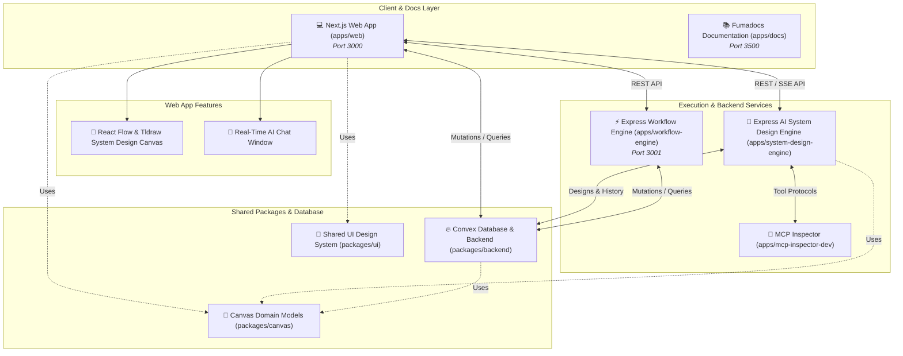

# Dezign2App — System Design Automation Monorepo

Welcome to **Dezign2App** (Blueprint)—a state-of-the-art, high-performance, enterprise-grade monorepo designed to build, edit, and analyze system design architectures and cloud infrastructure diagrams.

This platform combines visual canvas editors, stateful AI graph execution, Model Context Protocol (MCP) tooling, real-time streaming, secure multi-tenant authentication, and subscription billing into a unified TypeScript workspace.

[](https://nextjs.org/)
[](https://react.dev/)
[](https://convex.dev/)
[](https://tailwindcss.com/)
[](https://pnpm.io/)
[](https://clerk.com/)
[](https://fumadocs.vercel.app)

---

## 🏗️ Monorepo Architecture

This repository is powered by a high-performance **pnpm Workspace** and **Turborepo**, optimizing dependency sharing, task caching, and parallel execution across specialized applications and shared packages.



---

## 📱 Applications (`/apps`)

| App Directory | Core Stack | Port | Description |
| :--- | :--- | :--- | :--- |
| [**`apps/web`**](./apps/web) | Next.js 16 (Turbopack), React 19, Tailwind v4, `@xyflow/react`, Tldraw, Clerk, Creem, Framer Motion | `3000` | **Interactive Frontend Canvas & App Portal**: Multi-tenant protected user portal with workspace folders, drag-and-drop system design canvas using React Flow & Tldraw, embedded AI chat panel, and API Key/billing administration. |
| [**`apps/system-design-engine`**](./apps/system-design-engine) | Express.js, `@langchain/langgraph`, LangChain Core, MCP SDK, Groq SDK, Convex Client | Custom | **High-Performance AI System Design Engine**: Computes system design analysis using LangGraph state machines, coordinates architecture node generation, MCP tools, and custom API limiters. |
| [**`apps/workflow-engine`**](./apps/workflow-engine) | Express.js, `@langchain/langgraph`, LangChain Core, Inngest SDK, Upstash Redis & Realtime, Convex Client | `3001` | **Secondary Background Orchestration Service**: Handles background job execution, event queues, and Redis state streaming. |
| [**`apps/docs`**](./apps/docs) | Next.js 16, React 19, Fumadocs UI / Core / MDX, Tailwind v4 | `3500` | **Technical Documentation Portal**: Integrated developer documentation site covering system design architecture, setup guides, and monorepo scripts. |
| [**`apps/inngest-dev`**](./apps/inngest-dev) | `inngest-cli` | CLI | **Inngest Task Dev Server**: CLI runner for background queue testing (`http://localhost:3001/inngest`). |
| [**`apps/mcp-inspector-dev`**](./apps/mcp-inspector-dev) | `@modelcontextprotocol/inspector` | CLI / UI | **MCP Dev Console**: Interactive tool interface enabling validation and testing of Model Context Protocol configurations. |

---

## 📦 Packages (`/packages`)

| Package Directory | Core Technologies | Description |
| :--- | :--- | :--- |
| [**`packages/backend`**](./packages/backend) | Convex, TypeScript, Svix, Zod, Cron Parser | **Core Database & Backend Layer**: Type-safe Convex schemas, database indexes, Clerk auth webhooks, API key validators, and Creem subscription billing managers. |
| [**`packages/canvas`**](./packages/canvas) | Zod, TypeScript | **Shared Pure Domain Models**: Pure domain models and Zod schemas for canvas nodes, edges, state transitions, and system design structures. |
| [**`packages/ui`**](./packages/ui) | React 19, Tailwind CSS v4, Radix Primitives, Lucide Icons | **Shared Design System**: Reusable React component package built using Tailwind CSS v4 and shadcn/ui primitives. |
| [**`packages/eslint-config`**](./packages/eslint-config) | ESLint 9 | Monorepo-wide code style configurations. |
| [**`packages/typescript-config`**](./packages/typescript-config) | TypeScript 5 | Monorepo-wide strict TypeScript compiler settings. |

---

## 🌟 Key Features

1. **Visual Drag-and-Drop System Design Canvas**
   - Built on top of **React Flow (`@xyflow/react`)** and **Tldraw** for fluid diagramming layouts.
   - Design custom node configurations for cloud infrastructure, databases, and microservices.
   - Draw custom edge bindings for data flow, networking, and API connections.

2. **Durable LangGraph AI Execution Engine**
   - Stateful multi-step graph nodes running inside `system-design-engine`.
   - Native integration with LLM providers (Google Gemini, Groq, etc.).
   - Support for **Model Context Protocol (MCP)** standard tools to inspect databases, query systems, or execute commands.

3. **Robust Database & Billing System**
   - Built using **Convex**, providing real-time reactive queries and guaranteed atomic database mutations.
   - Secure and scalable **Clerk** multi-tenant authentication integration.
   - Subscription tier manager leveraging **Creem billing** integration.

4. **Integrated Documentation Portal**
   - Full technical documentation site powered by **Fumadocs** hosted in `apps/docs`.

---

## 🚀 Quick Start Guide

### 1. Prerequisites

Ensure you have the following installed on your machine:

- **Node.js** >= 20.0
- **pnpm** >= 10.4.1

### 2. Configure Environment Variables

Create copies of environment files for each layer:

#### `packages/backend/.env.local`
```env
CONVEX_DEPLOYMENT=your-convex-deployment-url
CLERK_SECRET_KEY=your-clerk-secret
CLERK_JWT_ISSUER_DOMAIN=your-clerk-domain
CREEM_API_KEY=your-creem-key
```

#### `apps/system-design-engine/.env`
```env
PORT=3001
CORS_ORIGIN=http://localhost:3000
CONVEX_URL=your-convex-deployment-url
SYSTEM_CORE_SECRET=your-internal-secret
GEMINI_API_KEY=your-gemini-api-key
GROQ_API_KEY=your-groq-api-key
```

#### `apps/web/.env.local`
```env
NEXT_PUBLIC_CONVEX_URL=your-convex-deployment-url
NEXT_PUBLIC_CLERK_PUBLISHABLE_KEY=your-clerk-publishable-key
CLERK_SECRET_KEY=your-clerk-secret-key
```

### 3. Install Dependencies

Run at the root of the workspace:

```bash
pnpm install
```

### 4. Run Development Ecosystem

Start services using **Turborepo**:

```bash
pnpm dev
```

This command spins up:
- Next.js Web Portal (`http://localhost:3000`)
- AI System Design Engine (`http://localhost:3001`)
- Technical Documentation Portal (`http://localhost:3500`)
- MCP Inspector UI Console & Convex backend

---

## 🛠️ Monorepo Commands

### Global Scripts

| Command | Action |
| :--- | :--- |
| `pnpm dev` | Starts development services. |
| `pnpm build` | Production build across all workspace targets. |
| `pnpm lint` | Runs ESLint across all apps and packages. |
| `pnpm format` | Formats all files with Prettier. |
| `pnpm test` | Runs unit and integration tests. |
| `pnpm test:e2e` | Runs Playwright E2E browser tests. |

### Workspace Filtering

Target specific applications with `--filter`:

```bash
# Run web app only
pnpm --filter web dev

# Run system design engine only
pnpm --filter system-design-engine dev

# Run documentation site only
pnpm --filter docs dev

# Start Convex dev backend
pnpm --filter backend dev
```

---

## 🧪 Testing Guidelines

- **Unit & Integration Testing**: Powered by **Vitest** for instant feedback loops (`.test.ts` or `.spec.ts`).
- **End-to-End Visual Testing**: Built using **Playwright** inside `apps/web/e2e/` to test UI states, auth flows, and React Flow canvases.

To run tests:

```bash
pnpm test
pnpm --filter web test:e2e
```

---

## 🎨 Managing Shared UI Components

The shared component library resides inside `packages/ui`. To add new components:

```bash
pnpm dlx shadcn@latest add button -c apps/web
```

Import in your Next.js application:

```tsx
import { Button } from "@workspace/ui/components/button";
```

---

## 📜 License

This project is licensed under an **Open Source Non-Compete License**. You are free to inspect, fork, learn from, and build non-competing personal or educational projects with this codebase. However, hosting, deploying, or distributing this software as a direct commercial competitor to **Dezign2App** is strictly prohibited.

For complete terms, please read the [LICENSE.md](./LICENSE.md). Created by **Subhash Nayak**.

